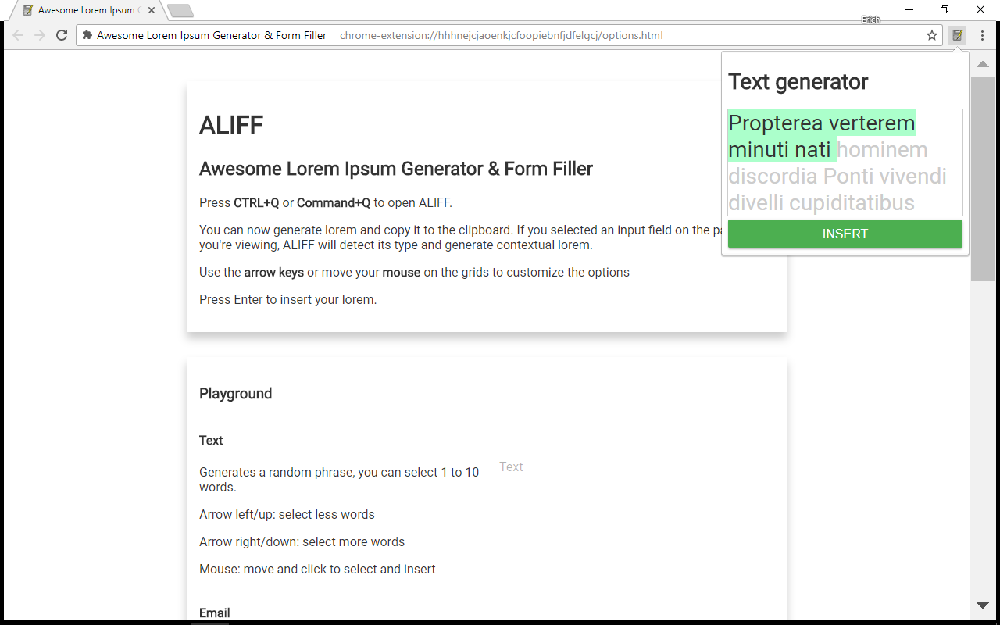
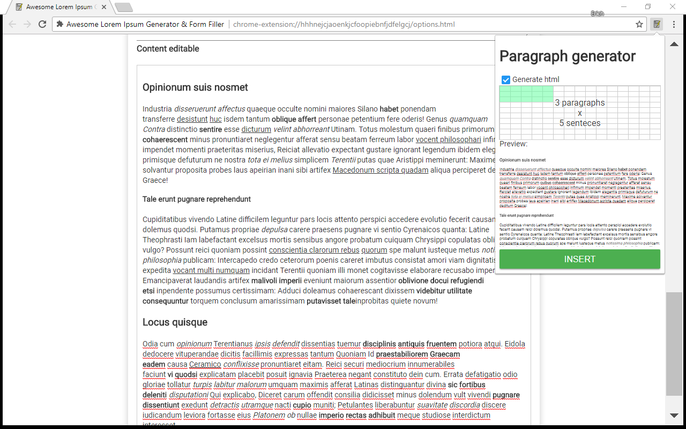
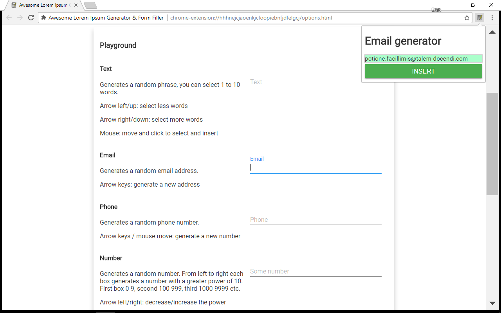
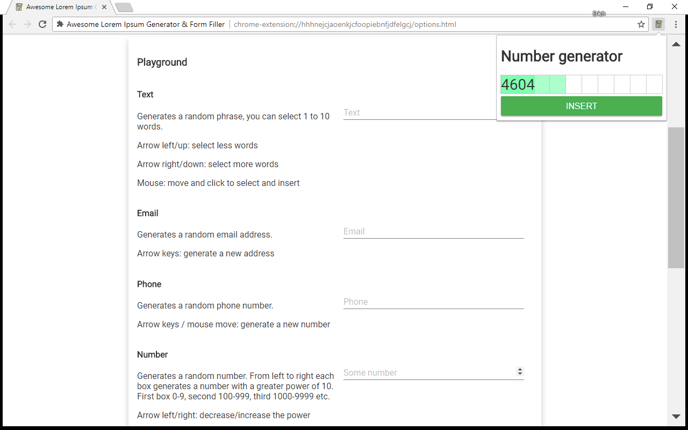
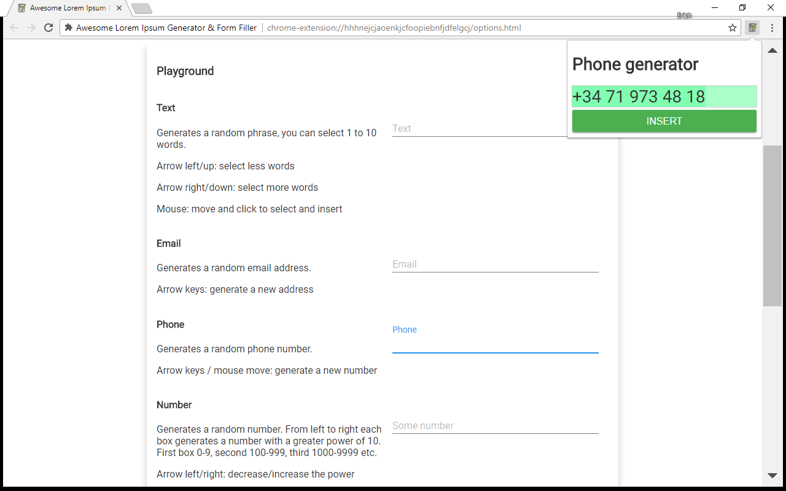

# Awesome Lorem Ipsum Generator & Form Filler

Chrome extension to generate lorem ipsum or other random text, html or numbers to quickly fill your forms.

Select an input field on your page, press **CTRL+Q**, press enter. Done!

You can also use your **arrow keys** or **mouse** to play around with the settings and customize the length of the text to insert or generate different values.

This extension uses browsers copy and paste commands to ensure javascript events are triggered and the form is properly handled by the page.

## Extension on Chrome Web Store

## Features

Support for:

- Text: single line text inputs
- Paragraph: multiline, textarea
- HTML: content editable, rich text editors
- Email input
- Number input
- Phone input

### Text

<table>
<tr>
<td width="300" valign="top">

</td>
<td>
Generates a random phrase, you can select 1 to 10 words.

Arrow left/up: select less words

Arrow right/down: select more words

Mouse: move and click to select and insert
</td>
</tr>
</table>

### Paragraph with optional html

<table>
<tr>
<td width="300" valign="top">

</td>
<td valign="top">
Generates random paragraphs. You can select the number of paragraphs and number of sentences in each paragraph. To better simulate real world randomness, the actual number of sentences will be slightly randomized (ie: if you select 6 you could get 5 to 7 sentences) and each sentence length is also random. You can enable or disable the html option to insert random headings, strong, em and u tags

Arrow keys / mouse move: adjust the settings
</td>
</tr>
</table>

### Email

<table>
<tr>
<td width="300" valign="top">

</td>
<td valign="top">
Generates a random email address.

Arrow keys: generate a new address
</td>
</tr>
</table>

### Number

<table>
<tr>
<td width="300" valign="top">

</td>
<td valign="top">
Generates a random number. From left to right each box generates a number with a greater power of 10. First box 0-9, second 10-99, third 100-999 etc.

Arrow left/right: decrease/increase the power

Arrow up/down: generate a new number with the current power setting

Mouse: move to generate new numbers andcustomize the power, then click insert
</td>
</tr>
</table>

### Phone number

<table>
<tr>
<td width="300" valign="top">

</td>
<td valign="top">
Generates a random phone number.

Arrow keys / mouse move: generate a new number
</td>
</tr>
</table>

## Why ALIFF?

As a web developer I sometimes have to fill forms and content pages to test them out. I've tried a few different form fillers and lorem ipsum generators and they usually lack some feature: no support for content editable fields, no html generation, no support for various field types and options are usally limited or complicated. So I've created ALIFF to combine all these features in a single place and make them simple to use.
